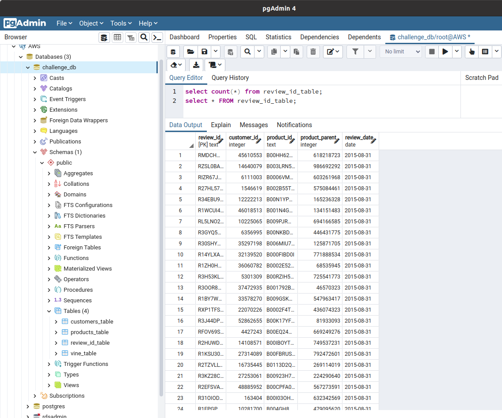
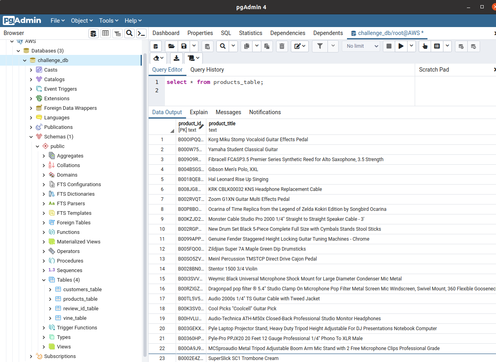
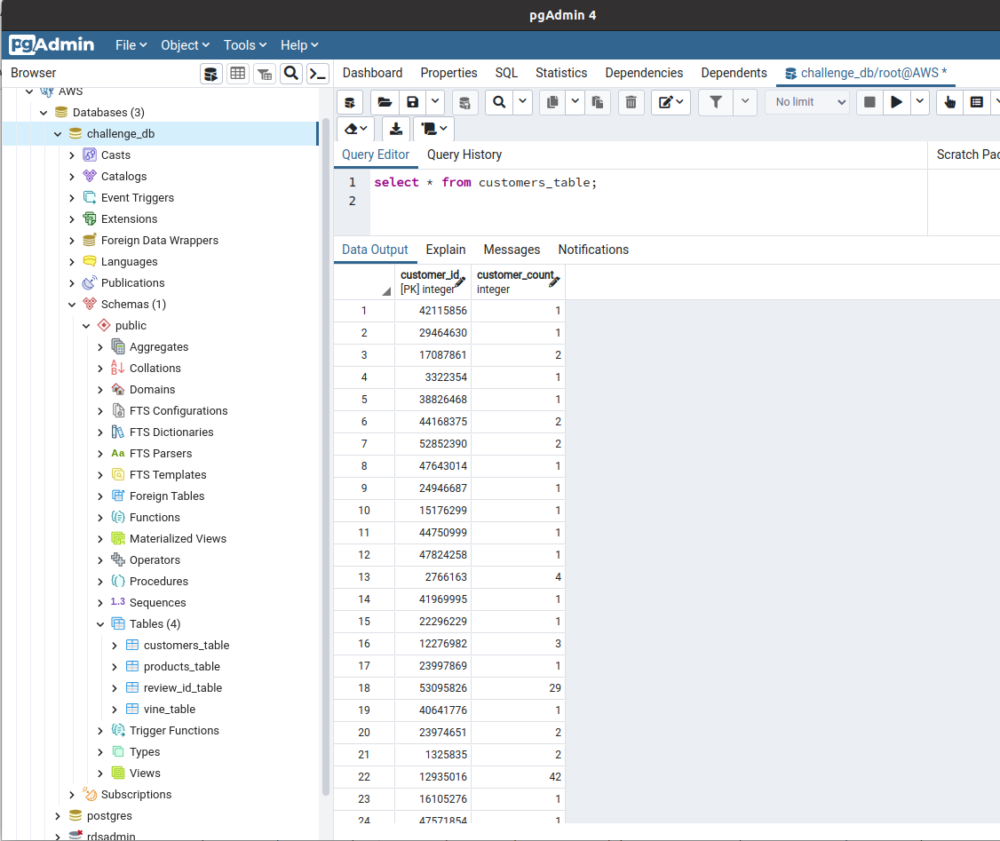
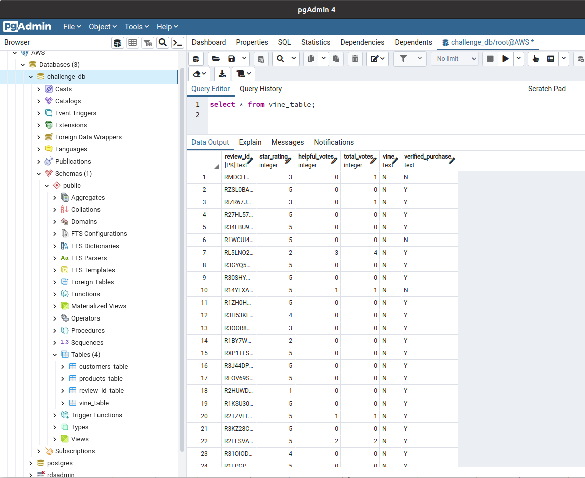

# Amazon Vine Analysis


# Overview
This project is to analyize the reviews written by members of the paid Amazon Vine program. This program is a service that allows manufacturers and publishers to receive reviews for their products. Companies like SellBy pay a small fee to Amazon and provide products to Amazon Vine members, who are then required to provide a review.

In this project, I picked a product that was reviewed, from approximately 50 different products, from clothing apparel to wireless products.  

For Deliverable 1, I will use PySpark to perform the ETL process to extract the dataset, transform the data, connect to an AWS RDS instance, and lod the transformed data into pgAdmin.

For Deliverable 2, I will use Pyspark to read in the exported vine_table, in csv format, into a DataFrame, and determine if there is any bias towards favorable reviews from Vine members.

The results of the above, will allow me to provide SellBy the information they can analyize during their decision process to invest into using or not using the Amazon Vine program.

# Resources
* Data Sources: https://s3.amazonaws.com/amazon-reviews-pds/tsv/amazon_reviews_us_Musical_instruments_v1_00.tsv.gz
* Software: Google Colaboratory, Python, PySpark, Spark, Amazon Web Services, PostgreSQL

# GitHub Application Link

<a href="https://jillibus.github.io/Amazon_Vine_Analysis">Amazon Vine Analysis</a>

# Deliverable 1: Perform ETL on Amazon Product Reviews

For my analysis, I chose the product, Musical Instruments. My family, is large, and my parents encouraged us to join clubs, play sports, as well as join the band. All of my siblings, there are 6 kids total, played at least 2 instruments from middle school through high school. I even played during my first year of college.  So this product caught my eye, right away.

I first read it into a DataFrame, with PySpark.
```
from pyspark import SparkFiles
url = "https://s3.amazonaws.com/amazon-reviews-pds/tsv/amazon_reviews_us_Musical_Instruments_v1_00.tsv.gz"
spark.sparkContext.addFile(url)
df = spark.read.option("encoding", "UTF-8").csv(SparkFiles.get("amazon_reviews_us_Musical_Instruments_v1_00.tsv.gz"), sep="\t", header=True, inferSchema=True)
df.show()
+-----------+-----------+--------------+----------+--------------+--------------------+-------------------+-----------+-------------+-----------+----+-----------------+--------------------+--------------------+-----------+
|marketplace|customer_id|     review_id|product_id|product_parent|       product_title|   product_category|star_rating|helpful_votes|total_votes|vine|verified_purchase|     review_headline|         review_body|review_date|
+-----------+-----------+--------------+----------+--------------+--------------------+-------------------+-----------+-------------+-----------+----+-----------------+--------------------+--------------------+-----------+
|         US|   45610553| RMDCHWD0Y5OZ9|B00HH62VB6|     618218723|AGPtek® 10 Isolat...|Musical Instruments|          3|            0|          1|   N|                N|         Three Stars|Works very good, ...| 2015-08-31|
|         US|   14640079| RZSL0BALIYUNU|B003LRN53I|     986692292|Sennheiser HD203 ...|Musical Instruments|          5|            0|          0|   N|                Y|          Five Stars|Nice headphones a...| 2015-08-31|
```
Next I extracted each table data I wanted from the DataFrame 'df' and created new "table" DataFrames
```
# Create the customers_table DataFrame
customers_df = df.groupby("customer_id").agg({"customer_id":"count"}).withColumnRenamed("count(customer_id)", "customer_count")
customers_df.show(5)
+-----------+--------------+
|customer_id|customer_count|
+-----------+--------------+
|   27314089|             1|
|    6711334|             1|
|   44525866|             4|
|   47461997|             1|
|   42560427|             1|
+-----------+--------------+
```
This was repeated for the remaining 3 tables, products_table, review_id_table, and vine_table. Each have a corresponding DataFrame, products_df, review_id_df and vine_df.

Lastly, I setup an RDS PostgreSQL Database on the Amazon Web Services and in the PySpark program listed the connection configuration to the database.  I also set up a connection in pgAdmin so I could view the tables locally in my desktop.  I created the 4 tables through the pgAdmin interface so I could load them from the PySpark program.

Once the program was connected, I inserted to each database table the contents of each of the table DataFrames.
```
review_id_df.write.jdbc(url=jdbc_url, table='review_id_table', mode=mode, properties=config)
products_df.write.jdbc(url=jdbc_url, table='products_table', mode=mode, properties=config)
customers_df.write.jdbc(url=jdbc_url, table='customers_table', mode=mode, properties=config)
vine_df.write.jdbc(url=jdbc_url, table='vine_table', mode=mode, properties=config)
```
Below is queries, in pgAdmin showing the data was uploaded into the AWS Database.
 

                                                    


# Deliverable 2: Determine Bias of Vine Reviews

# Results

* Bulleted list that addresses the three questions for paid and unpaid program reviews
* 


# Summary

* Summary states whether or not there is bias, and the results support this statement.
* An additional analysis is recommended to support the statement.
